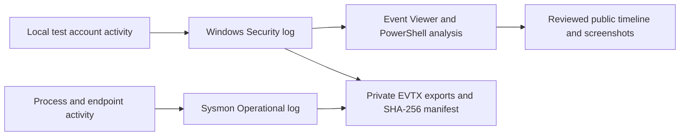
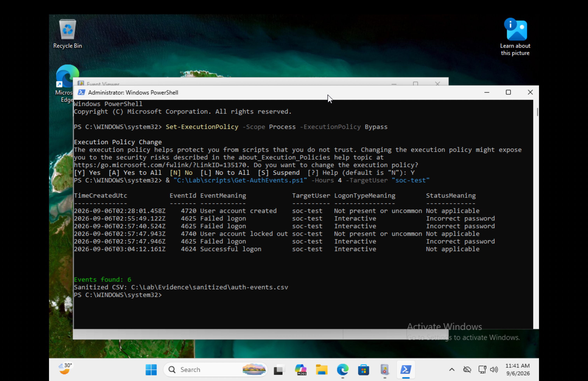

# Windows Active Directory Lab

### Phase 1: Windows Security Monitoring & Authentication Investigation

A hands-on investigation of local Windows account activity using Security event logs, Sysmon, and PowerShell.

## Project overview

I built a Windows 11 lab to answer a practical analyst question: **How can I reconstruct account creation, failed sign-ins, account lockout, and a later successful sign-in from Windows logs?**

The project demonstrates audit configuration, event filtering, timeline analysis, and evidence preservation. The supplied case contains six relevant Security records across four event IDs for the disposable `soc-test` account.

**Scope:** one Windows endpoint with local accounts. Active Directory Domain Services, domain joining, and domain Group Policy are planned extensions; they are not part of the completed evidence.

## Environment

| Component | Lab setup |
| --- | --- |
| Host | Apple M2 Pro; 16 GB RAM reported in the original build notes |
| Virtualization | VMware Fusion; ARM64 guest |
| Windows VM | Windows 11 Pro; `WIN11-SOC-LAB`; 4 vCPU; 6 GB RAM; 80 GB virtual disk |
| Network | VMware NAT / “Share with my Mac” |
| Tools | Windows Security auditing, Event Viewer, Microsoft Sysmon, PowerShell |
| Test identity | Local account `soc-test`; separate `SOC` administrator |

NAT provides outbound connectivity; it is not a fully isolated network. The tests use only the disposable account inside the lab VM.



## Investigation outcome

| Evidence | Observation | Why it matters |
| --- | --- | --- |
| 4720 | Test account created | Establishes the identity used in the exercise |
| 4625 × 3 | Interactive sign-in failures; reported code `0xC000006A` | Supports incorrect-password failures for the test account |
| 4740 | Account lockout recorded | Confirms the lockout event was generated |
| 4624 | Later interactive logon | Supports a subsequent successful sign-in |

This was a controlled test, not an identified attack. Event IDs alone do not establish malicious intent. I considered the target account, time, logon type, and failure detail together.



Read the [case study and exact timeline](docs/investigation.md). The timeline preserves the source order, including the lockout event appearing 3 ms before the final failed-logon record.

## What this demonstrates

- Configuring audit subcategories and checking their effective state.
- Distinguishing account-management events from logon events.
- Filtering noisy logs to an account and time window.
- Parsing named XML fields instead of relying on changing field positions.
- Recording UTC timestamps and record IDs for traceability.
- Exporting evidence privately and recording SHA-256 hashes.
- Explaining the limits of a conclusion and identifying the next validation step.

## Explore the project

| Resource | What it contains |
| --- | --- |
| [Lab guide](docs/lab-guide.md) | Essential commands, why they are used, expected results, and cleanup |
| [Investigation](docs/investigation.md) | Six-record timeline, analysis, and evidence limitations |
| [Scripts](scripts/) | Audit configuration, event parsing, and private evidence export |
| [Screenshot review](docs/screenshots.md) | All original images assessed; keep, omit, and recapture decisions |
| [Validation and gaps](docs/validation-and-gaps.md) | What is demonstrated and what still needs checking |
| [AD extension roadmap](docs/active-directory-roadmap.md) | Requirements for a genuine domain-based version |
| [Interview guide](docs/interview-guide.md) | Project explanation, technical questions, and résumé wording |
| [Evidence notes](evidence/README.md) | Provenance of the supplied CSV summaries |

## Reproduce the workflow

Use an owned Windows lab, a recoverable snapshot, and an elevated PowerShell session for configuration and Security-log access. Start with the [lab guide](docs/lab-guide.md); it explains the steps and their effects.

```powershell
# Run from a local copy of this repository in the Windows lab.
.\scripts\Enable-LabAuditing.ps1

# Create the test activity using the manual procedure in the lab guide.
.\scripts\Get-AuthEvents.ps1 -Hours 4 -TargetUser 'soc-test'
.\scripts\Export-LabEvidence.ps1 -AnalystName 'LAB_ANALYST'
```

The revised scripts are supplied for the next lab run. They have not been executed against the Windows VM during this portfolio review. Historical screenshots show the earlier workflow and output format.

## Evidence status

Screenshots and two supplied CSV summaries were reviewed. Raw EVTX files and original machine-generated CSVs were not supplied, so the EVTX hashes cannot be independently recomputed here. The image capture times and guest clock also need reconciliation before making cross-device timing claims. These limits are documented in the [case study](docs/investigation.md).

The public repository contains selected lab screenshots and summaries. Generated event exports retain identifying fields and require review before sharing; a CSV export is not automatically anonymized.
