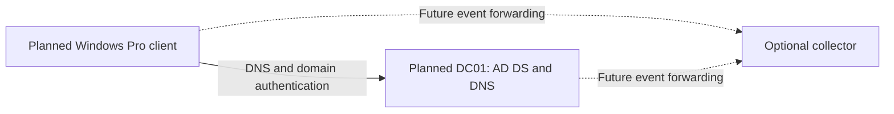

# Active Directory extension roadmap

**Status: planned extension.** The supplied project demonstrates local Windows security monitoring. It does not yet establish that Active Directory Domain Services (AD DS), a domain controller, domain membership, or domain Group Policy was configured.

The current test account, `WIN11-SOC-LAB\soc-test`, was created with `New-LocalUser`. A local account is held in that computer's Security Accounts Manager database; an AD account is a directory object managed by the domain. Events such as 4720 and 4740 can occur in a local-account lab, so those event IDs alone do not prove AD administration. [Microsoft: security principals](https://learn.microsoft.com/en-us/windows-server/identity/ad-ds/manage/understand-security-principals)

## Finish the current project first

These are the highest-value improvements before expanding the architecture:

| Priority | Missing or incomplete evidence | Completion check |
| --- | --- | --- |
| 1 | Original machine-readable event output and separate `Status` / `SubStatus` values | Re-export the chosen run, retain the original privately, and publish reviewed fields with host, channel, record ID, UTC timestamp and event version. The supplied six-row CSV is a transcription, not a raw event export. |
| 1 | Independent validation of the two EVTX hashes | Recompute SHA-256 against the private files and compare with the original collection manifest. A hash summary alone cannot verify files that were not supplied. |
| 1 | A complete reproduction record | Save test start/end times, effective audit settings, effective lockout settings, relevant events and cleanup outcome for one run. Keep later runs separate from the September 6 run. |
| 1 | Clock accuracy and active Sysmon configuration | Record the guest time source and compare with a trusted reference; screenshot filenames and guest clocks differ. Export the active Sysmon configuration, because screenshots show `sysmon-lab-clean.xml` while the supplied file is `sysmon-lab.xml`. |
| 2 | Complete Sysmon process context | Existing screenshots show Notepad process creation and command-line details. Add a readable event/XML extract with parent process, `ProcessGuid` and UTC time; the supplied views cut off most ancestry fields. Explain what the additional fields contribute. |
| 2 | A detection check with a comparison case | Compare the intentional lockout sequence with a normal successful sign-in. Document which conditions would cause an alert and why a failed password alone is insufficient. Label this as a planned check until executed. |
| 2 | Repeatable cleanup and retained settings | Verify removal or disabling of the disposable account and restoration of recorded settings, or document a deliberate snapshot restore. Do not claim cleanup based only on the existence of instructions. |

## Choose a compatible AD lab host

The existing host is an Apple M2 Pro, and the Windows client uses ARM64. Fusion on Apple Silicon supports ARM64 guest operating systems; it does not run an x86/x64 Windows Server guest through normal virtualization. Microsoft lists x64 processor requirements for Windows Server 2025. Windows on ARM's application emulation does not make an x64 server operating system a supported Fusion guest. [Broadcom: Apple Silicon guest compatibility](https://knowledge.broadcom.com/external/article/315602), [Microsoft: Windows Server hardware requirements](https://learn.microsoft.com/en-us/windows-server/get-started/hardware-requirements?pivots=windows-server-2025&tabs=cpu)

**Suggested next environment:** a separate compatible x64 computer hosting a Windows Server DC and a Windows Pro client on an isolated virtual network. An alternative is an x64 cloud lab with both machines on a private network, restricted administration access, a budget limit and a teardown plan. These are proposed designs, not resources already deployed. Reuse the current ARM client only after validating supported Windows edition, private connectivity, DNS and domain-join behavior.



Start with one DC and one client. A second DC, separate file server and dedicated collector can follow once the basic scenario works. The diagram is a future design; it is not evidence of implementation.

## Build in stages with evidence gates

| Stage | Work to implement | Evidence required before claiming completion |
| --- | --- | --- |
| 1. Domain foundation | Deploy supported Windows Server, AD DS and DNS; choose a lab namespace; record the network and time design. | `Get-ADDomain` and DC details; successful DNS service-record lookup from the client; recorded time source. |
| 2. Domain membership | Join a supported Windows Pro/Enterprise client; create a disposable standard **domain** user. | Client reports `PartOfDomain = True`; secure-channel check succeeds; `whoami` identifies the lab domain account. |
| 3. Organization and policy | Create a small OU structure for test users and computers. Link a narrowly scoped audit GPO and verify its effective settings. | OU/object view, GPO link/settings and `gpresult` output from the intended client; `auditpol` confirms resulting auditing. |
| 4. Access control | Use security groups for one simple resource-access example. Keep daily test users separate from administrators. | A permitted user succeeds and a comparison user is denied; membership and permissions explain both outcomes. |
| 5. Domain authentication analysis | Repeat a bounded sign-in scenario against the disposable domain account; collect relevant client and DC logs. | UTC timeline with account/domain, source machine, channel, record ID and event-specific fields; explanation of where each event was generated. |
| 6. Central collection | Add Windows Event Forwarding (WEF) after local collection works. | Forwarded event matches its source event; subscription health and a delayed/disconnected-source test are documented. |

OUs support policy scope and delegated administration; security groups support access permissions. Placing a user in an OU does not itself grant access to a file share. A simple lab can place users in a global role group, nest it in a domain local resource group, and grant that resource group the required permission. [Microsoft: Group Policy overview](https://learn.microsoft.com/en-us/windows-server/identity/ad-ds/manage/group-policy/group-policy-overview), [Microsoft: security groups](https://learn.microsoft.com/en-us/windows-server/identity/ad-ds/manage/understand-security-groups)

The current `net accounts` settings affect local account policy. Do not present them as domain policy. For the AD extension, verify the default domain password/lockout policy and any resultant fine-grained policy for the test user. Do not assume linking a password-policy GPO to a users OU sets that user's domain password policy. [Microsoft: password policy scope](https://learn.microsoft.com/en-us/previous-versions/windows/it-pro/windows-10/security/threat-protection/security-policy-settings/password-policy), [default domain password policy](https://learn.microsoft.com/en-us/powershell/module/activedirectory/get-addefaultdomainpasswordpolicy), [resultant user password policy](https://learn.microsoft.com/en-us/powershell/module/activedirectory/get-aduserresultantpasswordpolicy)

## Read-only verification commands

These are **future verification examples, not commands executed in the supplied project**. Run them on the specified lab machine after building the relevant stage. Replace example names with your lab values. AD cmdlets require the ActiveDirectory module and a reachable domain; access to Security logs and computer policy output may require elevation.

### 1. Verify the client, DNS and trust

```powershell
# Run on the Windows client. Establish whether it is local or domain joined.
Get-CimInstance Win32_ComputerSystem |
    Select-Object Name, Domain, PartOfDomain
whoami

# Planned domain example only; replace before running.
$LabDomain = 'ad.example.test'
Get-DnsClientServerAddress -AddressFamily IPv4
Resolve-DnsName -Type SRV "_ldap._tcp.dc._msdcs.$LabDomain"
w32tm /query /status

# Run only after this client has joined the domain.
Test-ComputerSecureChannel -Verbose
```

**Why:** the first commands distinguish a local identity from domain membership. The DNS query tests DC discovery, and the time query records the synchronization source. A successful secure-channel result supports a functioning member-computer trust. It does not replace application-level sign-in testing. Run `Test-ComputerSecureChannel` on the **domain member**, not the DC; Microsoft notes that DC results can be misleading. [Microsoft: domain join prerequisites](https://learn.microsoft.com/en-us/windows-server/identity/ad-ds/manage/join-computer-to-domain), [Microsoft: secure-channel test](https://learn.microsoft.com/en-us/powershell/module/microsoft.powershell.management/test-computersecurechannel?view=powershell-5.1)

### 2. Verify directory objects and effective policy

```powershell
# Run on the DC or an authorized administration machine with the AD module.
Get-ADDomain | Select-Object DNSRoot, NetBIOSName, PDCEmulator
Get-ADDomainController -Filter * |
    Select-Object HostName, IPv4Address, Site
Get-ADUser -Identity 'soc-domain-test' -Properties Enabled, LockedOut |
    Select-Object SamAccountName, DistinguishedName, Enabled, LockedOut

# Inspect both policy paths; a fine-grained policy can override the default.
Get-ADDefaultDomainPasswordPolicy |
    Select-Object LockoutThreshold, LockoutDuration, LockoutObservationWindow
Get-ADUserResultantPasswordPolicy -Identity 'soc-domain-test' |
    Select-Object Name, LockoutThreshold, LockoutDuration, LockoutObservationWindow

# Run on the intended client to inspect the applied computer policy.
gpresult /r /scope computer
auditpol /get /category:*
```

**Why:** object queries show what exists and where it is located. Policy queries show the expected lockout behavior; when no resultant fine-grained policy is returned, check the default domain policy. `gpresult` and `auditpol` test what reached the client, rather than relying only on a GPO editor screenshot. If a command fails, investigate that failure rather than treating blank output as a pass. [Microsoft: gpresult](https://learn.microsoft.com/en-us/windows-server/administration/windows-commands/gpresult)

### 3. Inspect DC authentication records by named fields

```powershell
# Run locally on the DC after the planned domain test.
$LabStart = (Get-Date).AddMinutes(-30)
Get-WinEvent -FilterHashtable @{
    LogName = 'Security'
    Id = 4768, 4769, 4771
    StartTime = $LabStart
} | ForEach-Object {
    $LabEvent = $_
    $LabFields = @{}
    ([xml]$LabEvent.ToXml()).Event.EventData.Data | ForEach-Object {
        $LabFields[$_.Name] = $_.'#text'
    }
    if ($LabFields['TargetUserName'] -eq 'soc-domain-test') {
        [pscustomobject]@{
            TimeUtc = $LabEvent.TimeCreated.ToUniversalTime().ToString('o')
            Computer = $LabEvent.MachineName
            Channel = $LabEvent.LogName
            RecordId = $LabEvent.RecordId
            EventId = $LabEvent.Id
            Version = $LabEvent.Version
            TargetUser = $LabFields['TargetUserName']
            ServiceName = $LabFields['ServiceName']
            ClientAddress = $LabFields['IpAddress']
            Status = $LabFields['Status']
        }
    }
} | Sort-Object TimeUtc, RecordId | Format-Table -AutoSize
```

**Why:** filtering by time and event ID reduces irrelevant records; reading XML fields by name avoids depending on array position. Record host, channel and version alongside the record ID. Missing fields remain blank because event schemas differ. No matching events can mean the time range, audit policy, DC selection, cached sign-in or authentication method needs investigation; it is not proof that authentication never happened.

## Collect from the right computer

| Event | Meaning | Where to look in this extension |
| --- | --- | --- |
| 4624 | A logon session was created | The accessed machine where the session was created. |
| 4625 | Failed logon | The machine where the attempted logon occurred; do not assume every domain failure appears as 4625 on the DC. |
| 4720 / 4740 | User creation / lockout | For the current local test, the local host. For domain-account changes, collect from the relevant DCs. |
| 4768 | Kerberos ticket-granting ticket request | DC Security log; record result and client information. |
| 4769 | Kerberos service-ticket request | DC Security log; inspect the requested service and result. |
| 4771 | Kerberos pre-authentication failure | DC Security log; interpret the failure code rather than assuming every failure is a wrong password. |

The relevant DC auditing includes **Kerberos Authentication Service**, **Kerberos Service Ticket Operations** and **User Account Management**; the client also needs the applicable logon auditing. Kerberos events are not expected merely because a local `soc-test` account signed in. Ticket caching and cached domain sign-ins also mean one user action does not always produce every listed event. [Microsoft: 4624](https://learn.microsoft.com/en-us/previous-versions/windows/it-pro/windows-10/security/threat-protection/auditing/event-4624), [4625](https://learn.microsoft.com/en-us/previous-versions/windows/it-pro/windows-10/security/threat-protection/auditing/event-4625), [4740](https://learn.microsoft.com/en-us/previous-versions/windows/it-pro/windows-10/security/threat-protection/auditing/event-4740), [4768](https://learn.microsoft.com/en-us/previous-versions/windows/it-pro/windows-10/security/threat-protection/auditing/event-4768), [4769](https://learn.microsoft.com/en-us/previous-versions/windows/it-pro/windows-10/security/threat-protection/auditing/event-4769), [4771](https://learn.microsoft.com/en-us/previous-versions/windows/it-pro/windows-10/security/threat-protection/auditing/event-4771)

Central collection is a later milestone. WEF subscriptions can forward selected events to a collector; prove delivery using a known source event and retain the source computer field. Simply enabling the collector service is not a completed monitoring pipeline. [Microsoft: Windows Event Collector](https://learn.microsoft.com/en-us/windows/win32/wec/windows-event-collector)

## Additional screenshots for the AD extension

Capture these only after completing the corresponding work:

1. Architecture and host roles, including the actual server/client platforms.
2. DC/domain output and DNS service-record lookup from the client.
3. Client domain membership, successful trust check and domain-user `whoami`.
4. OU structure, standard user and security-group membership.
5. GPO link and client `gpresult` with resulting `auditpol` settings.
6. Effective account policy and correlated client/DC authentication events.
7. If implemented, collector delivery of the same event with its source identity.

Use readable crops and short captions stating **what each screenshot proves**. A folder tree, installation wizard or successful command without its relevant output is not enough. The repository uses the requested Active Directory name. Keep its phase-one subtitle and explicit planned status until the domain foundation, membership, policy and domain-authentication stages have supporting evidence.
