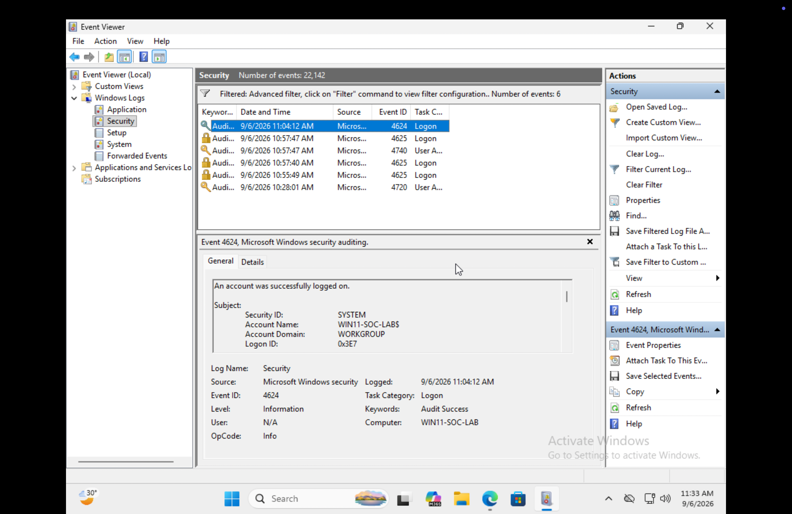
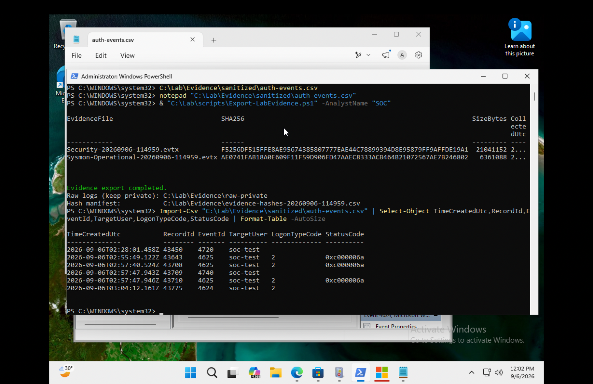

# Investigation: local account lockout and recovery

## Question and scope

Could I identify the activity of one disposable account within a noisy Windows Security log, explain the authentication sequence, and preserve the resulting evidence?

The exercise used `soc-test` on `WIN11-SOC-LAB`. It involved manual test sign-ins in a standalone Windows VM. There is no evidence here of a real compromise, domain authentication, or an automated detection deployment.

## Evidence-based timeline

The following values come from the supplied `auth-events-summary.csv` and match the readable PowerShell output in [the evidence-export screenshot](../images/10-evidence-hashes-and-record-ids.png). All rows are dated **6 September 2026**.

| UTC | Singapore time (UTC+08:00) | Record ID | Event ID | Observation |
| --- | --- | --- | --- | --- |
| 02:28:01.458 | 10:28:01.458 | 43450 | 4720 | `soc-test` created |
| 02:55:49.122 | 10:55:49.122 | 43643 | 4625 | Failed interactive sign-in; derived code `0xC000006A` |
| 02:57:40.524 | 10:57:40.524 | 43708 | 4625 | Failed interactive sign-in; same derived code |
| 02:57:47.943 | 10:57:47.943 | 43709 | 4740 | Account lockout recorded |
| 02:57:47.946 | 10:57:47.946 | 43710 | 4625 | Failed interactive sign-in; same derived code |
| 03:04:12.161 | 11:04:12.161 | 43775 | 4624 | Successful interactive sign-in |

The final failed-logon record and the lockout record are only **3 milliseconds apart**. I preserve their recorded order; this does not establish a precise causal ordering inside Windows. The success is recorded about **6 minutes 24 seconds** after the lockout, consistent with the five-minute duration in the [effective-policy screenshot](../images/appendix-lab-lockout-policy.png). This does not independently establish whether recovery was automatic or manual.

## How I interpreted the records

**Identity:** filtering `TargetUserName` to `soc-test` separates the exercise from service and system activity. The subject and target can differ; the subject is not automatically the user whose sign-in is being investigated.

**Logon context:** the three failures and later success have logon type 2, which supports interactive activity. A 4624 alone would not prove someone signed in at the console. See [Microsoft's 4624 fields](https://learn.microsoft.com/en-us/previous-versions/windows/it-pro/windows-10/security/threat-protection/auditing/event-4624).

**Failure reason:** the supplied summary reports `0xC000006A`, consistent with an incorrect password. The original parser chose a nonzero `SubStatus` before falling back to `Status`. Its column `StatusCode` is therefore a derived value, not a faithful copy of the raw XML `Status` field. The revised parser retains both. See [Microsoft's 4625 field definitions](https://learn.microsoft.com/en-us/previous-versions/windows/it-pro/windows-10/security/threat-protection/auditing/event-4625).

**Lockout:** Event 4740 provides the account lockout observation. It belongs to User Account Management auditing. The separate Account Lockout audit subcategory concerns failed authentication to locked accounts. [Microsoft's 4740 reference](https://learn.microsoft.com/en-us/previous-versions/windows/it-pro/windows-10/security/threat-protection/auditing/event-4740).

**Conclusion:** the records are consistent with the planned local account lockout exercise and a later successful sign-in. They demonstrate an investigation workflow. They do not establish an external attack, an automated alert, or a domain-wide control.

## Selected evidence

### Account-focused event view

The view contains one account-creation event, three failed logons, one lockout, and one success. A selected event's subject may be SYSTEM; inspect the target fields before attributing the activity.

### Traceable output and evidence hashes

The screenshot supports the transcribed timestamps, record IDs, event IDs, target, logon types, diagnostic codes, filenames, byte sizes, and hashes. Its collection-time column is truncated. The paths and output labels shown belong to the earlier scripts; the revised scripts now default to private output directories.

### Supporting event details

- [4720: created account](../images/04-event-4720-created-account.png)
- [4625: failed sign-in target and logon type](../images/05-event-4625-failed-logon.png)
- [4740: locked account](../images/06-event-4740-account-lockout.png)
- [4624: successful sign-in target](../images/07-event-4624-successful-logon.png)
- [Sysmon process event](../images/03-sysmon-notepad-process.png)

## Evidence limitations and next action

| Limitation | Effect on the conclusion | Next action |
| --- | --- | --- |
| Raw EVTXs and original full CSV exports were not supplied | Values can be checked against screenshots, but the original logs and hashes cannot be independently verified | Retain originals privately; recompute hashes and save a comparison result |
| Capture filenames and guest times differ | Cross-device time correlation is unreliable without clock validation | Capture UTC/local time and synchronization source together; do not rewrite historical times |
| 4625 screenshot does not show all failure fields | Original Status/SubStatus cannot be reconstructed solely from the summary | Capture a readable event Details/XML view preserving both fields |
| Lockout policy is shown, but the original baseline and restoration are absent | The test settings are evidenced; restoration is not | Save before/after policy and cleanup verification on the next run |
| Sysmon is demonstrated independently; installation used `sysmon-lab-clean.xml` | Exact correspondence with the supplied `sysmon-lab.xml` and Security-to-Sysmon correlation are not proven | Capture active configuration and its hash; add a documented event correlation |
| No alert rule or repeatable alert test | This is manual analysis with a parser | Add a small detection rule plus expected-positive and expected-negative tests |

## What I would investigate in a real case

I would verify the affected identity and its privileges, examine source host and logon type, compare the pattern with expected user activity, and check whether other accounts or hosts are affected. A mistyped password, stale stored credentials, and a malicious attempt can all create failures. Any escalation would depend on corroborating evidence and the organization's response process, not the event ID alone.
